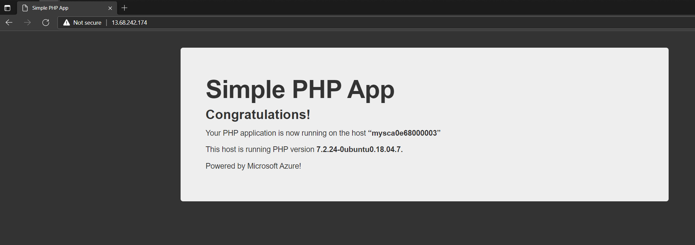

# How to setup Linux VMs with Apache and PHP using cloud-init and Virtual Machine Scale Sets

Going forward on my articles covering the usage of cloud-init, in this last article we will use cloud-init in a Virtual Machine Scale Set. With [Virtual Machine Scale Sets](https://docs.microsoft.com/en-us/azure/virtual-machine-scale-sets/overview) we can have a group of load balanced VMs and the number of VM instances can automatically increase or decrease in response to demand or a defined schedule. Scale sets provide high availability to applications, allowing to centrally manage, configure and update a large number of VMs.

Adding the usage of cloud-init in a VMSS, we can work with an efficient deployment model of applications. In this lab, the idea will be demontrate it using a [simple PHP application](https://github.com/ricmmartins/simple-php-app) being deployed at the VMs under the VMSS at the creation time of each VM. After the deployment, the VMs aren't changed anymore, all artifacts for the applications wil be already deployed within the VMs. This is a concept of Immutable Infrastructure, very well described here [https://medium.com/the-cloud-architect/immutable-infrastructure-21f6613e7a23#](https://medium.com/the-cloud-architect/immutable-infrastructure-21f6613e7a23#) and here [https://www.perylemke.com/posts/infra-imutavel/](https://www.perylemke.com/posts/infra-imutavel/) (in Brazilian-Portuguese)

✔️ Use the Bash environment in [Azure Cloud Shell](https://docs.microsoft.com/en-us/azure/cloud-shell/quickstart).

[](http://shell.azure.com/)

# Create a cloud-init.txt 
```
#cloud-config
package_upgrade: true
packages:
  - apache2
  - php
  - libapache2-mod-php
  - git

runcmd:
  - cd "/usr/share" && git clone https://github.com/ricmmartins/simple-php-app.git
  - mv /var/www/html /var/www/html-bkp
  - ln -s /usr/share/simple-php-app/ /var/www/html
```
# Create a resource group
```
az group create --name myResourceGroup --location eastus
```
# Create a network security group    
```
az network nsg create \
    --resource-group myResourceGroup \
    --name myScaleSetNSG
```
# Create a network security group rule
```
az network nsg rule create \
    --resource-group myResourceGroup \
    --nsg-name myScaleSetNSG \
    --name myNSGRuleHTTP \
    --protocol '*' \
    --direction inbound \
    --source-address-prefix '*' \
    --source-port-range '*' \
    --destination-address-prefix '*' \
    --destination-port-range 80 \
    --access allow \
    --priority 200
 ```     
# Create a scale set
```
az vmss create \
  --resource-group myResourceGroup \
  --name myScaleSet \
  --load-balancer myScaleSetLB \
  --vnet-name myScaleSetVNET \
  --public-ip-address myScaleSetLBPublicIP \
  --nsg myScaleSetNSG \
  --image UbuntuLTS \
  --admin-username azureuser \
  --custom-data cloud-init.txt \
  --generate-ssh-keys
```
✔️ You can set a specific VM instance size with the parameter --vm-sku. Here is a full list of options for the command az vmss create: [https://docs.microsoft.com/en-us/cli/azure/vmss?view=azure-cli-latest#az_vmss_create](https://docs.microsoft.com/en-us/cli/azure/vmss?view=azure-cli-latest#az_vmss_create)

# Create the health probe
```
az network lb probe create \
    --resource-group myResourceGroup \
    --lb-name myScaleSetLB \
    --name myHealthProbe \
    --protocol tcp \
    --port 80
```
# Create the load balancer rule
```
az network lb rule create \
    --resource-group myResourceGroup \
    --lb-name myScaleSetLB \
    --name myHTTPRule \
    --protocol tcp \
    --frontend-port 80 \
    --backend-port 80 \
    --frontend-ip-name loadBalancerFrontEnd \
    --backend-pool-name myScaleSetLBBEPool \
    --probe-name myHealthProbe \
    --disable-outbound-snat true \
    --idle-timeout 15 
 ``` 
 # View the VM instances in a scale set
```
az vmss list-instances \
  --resource-group myResourceGroup \
  --name myScaleSet \
  --output table
```
The following example output shows two VM instances in the scale set:
```
InstanceId    LatestModelApplied    Location    ModelDefinitionApplied    Name          ProvisioningState    ResourceGroup    VmId
------------  --------------------  ----------  ------------------------  ------------  -------------------  ---------------  ------------------------------------
1             True                  eastus      VirtualMachineScaleSet    myScaleSet_1  Succeeded            myResourceGroup  a8d57ac2-da22-43ab-bd57-edfef6ce065f
2             True                  eastus      VirtualMachineScaleSet    myScaleSet_2  Succeeded            myResourceGroup  ff5bc421-f8ea-40bd-8d69-722e1d5bdc37
```
# Test web access

Open your browser pointing to the Public IP Adress of your Load Balancer



✔️ If for some reason, you need to connect over SSH into your VMs for some troubleshooting, here are the steps needed:

* List connection information:
```
az vmss list-instance-connection-info \
  --resource-group myResourceGroup \
  --name myScaleSet
```
The following example output shows the instance name, public IP address of the load balancer, and port number that the NAT rules forward traffic to:
```
Instance 1          Instance 2
------------------  ------------------
13.68.242.174:50001  13.68.242.174:50002
```
* Create a network security group rule to allow SSH:
```
az network nsg rule create \
    --resource-group myResourceGroup \po
    --source-port-range '*' \
    --destination-address-prefix '*' \
    --destination-port-range 22 \
    --access allow \
    --priority 300
```
* SSH to your first VM instance. Specify your Load Balancer Public IP address and port number with the -p parameter, as shown from the preceding command:
```
ssh azureuser@13.68.242.174 -p 50001
```
# Change manually the capacity of a scale set

When you created a scale set at the start of the tutorial, two VM instances were deployed by default. You can specify the --instance-count parameter with az vmss create to change the number of instances created with a scale set. To increase or decrease the number of VM instances in your existing scale set, you can manually change the capacity. The scale set creates or removes the required number of VM instances, then configures the load balancer to distribute traffic.

To manually increase or decrease the number of VM instances in the scale set, use az vmss scale. The following example sets the number of VM instances in your scale set to 3:
```
az vmss scale \
    --resource-group myResourceGroup \
    --name myScaleSet \
    --new-capacity 3
```
# Using autoscale profile to change the capacity automatically
```
az monitor autoscale create \
  --resource-group myResourceGroup \
  --resource myScaleSet \
  --resource-type Microsoft.Compute/virtualMachineScaleSets \
  --name autoscale \
  --min-count 2 \
  --max-count 10 \
  --count 2
```
# Create a rule to autoscale out
```
az monitor autoscale rule create \
  --resource-group myResourceGroup \
  --autoscale-name autoscale \
  --condition "Percentage CPU > 70 avg 5m" \
  --scale out 3
```
# Create a rule to autoscale in
```
az monitor autoscale rule create \
  --resource-group myResourceGroup \
  --autoscale-name autoscale \
  --condition "Percentage CPU < 30 avg 5m" \
  --scale in 1
```
# Generate CPU load on scale set to Test

In [this url](https://docs.microsoft.com/en-us/azure/virtual-machine-scale-sets/tutorial-autoscale-cli#generate-cpu-load-on-scale-set) you can see a step-by-step on how to stress your scale set.

# Monitor the active autoscale rules
```
watch az vmss list-instances \
  --resource-group myResourceGroup \
  --name myScaleSet \
  --output table
```
Once the CPU threshold has been met, the autoscale rules increase the number of VM instances in the scale set.

References: 
[https://docs.microsoft.com/en-us/azure/virtual-machine-scale-sets/overview](https://docs.microsoft.com/en-us/azure/virtual-machine-scale-sets/overview)
[https://docs.microsoft.com/en-us/azure/virtual-machine-scale-sets/tutorial-create-and-manage-cli](https://docs.microsoft.com/en-us/azure/virtual-machine-scale-sets/tutorial-create-and-manage-cli)
